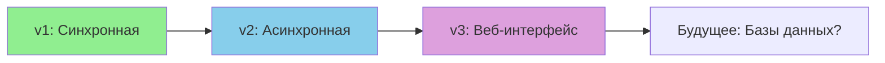

# 📚 Book Note - Документация

<p align="center">
  
  
  
  
</p>

<p align="center">
  📝 Трехуровневое погружение в мир консольных приложений на Node.js
</p>

---

## 📋 Содержание

- [Версия 1: Синхронная (Классика)](#-версия-1-синхронная-классика)
- [Версия 2: Асинхронная с поиском (Эволюция)](#-версия-2-асинхронная-с-поиском-эволюция)
- [Версия 3: Веб-интерфейс (Революция)](#-версия-3-веб-интерфейс-революция)
- [Сравнение версий](#-сравнение-версий)
- [Быстрый старт](#-быстрый-старт)

---

## 📦 Версия 1: Синхронная (Классика)

> **Фундамент, на котором всё строится** • *Просто, надежно, понятно*

<div align="center">
  
  
  
</div>

### 🎯 Концепция

Первая версия — это классическое синхронное консольное приложение. Всё происходит последовательно, шаг за шагом, как в старых добрых терминалах.

### ✨ Возможности

| Функция | Описание | Статус |
|---------|----------|--------|
| ➕ **Создание заметок** | Добавление заголовка и содержимого | ✅ |
| 📖 **Просмотр списка** | Все заметки с красивым оформлением | ✅ |
| 🗑️ **Удаление** | Удаление с автоматической перенумерацией | ✅ |
| 💾 **Сохранение** | Автоматическое сохранение в JSON | ✅ |
| 📊 **Статистика** | Подсчет количества заметок | ✅ |

### 🏗️ Архитектура

```
┌─────────────────┐     ┌─────────────────┐     ┌─────────────────┐
│    index.js     │────▶   helpers.js     ────▶  fileManager.js  │
│  (основной код) │     │ (вспомогательные│     │  (работа с JSON)│
└─────────────────┘     │    функции)     │     └─────────────────┘
                        └─────────────────┘
                               │
                               ▼
                        ┌─────────────────┐
                        │  decorator.js   │
                        │   (оформление)  │
                        └─────────────────┘
```

### 📄 Ключевые файлы

<details>
<summary><b>index.js</b> (основной файл)</summary>

```javascript
const readline = require('readline');
const helpers = require('./utils/helpers');
const Decorator = require('./utils/decorator');
const { saveNotes, loadNotes } = require('./utils/fileManager');

const rl = readline.createInterface({
    input: process.stdin,
    output: process.stdout
});

let entries = loadNotes();

function showMenu() {
    console.log('\n МЕНЮ ');
    console.log('1. Добавить запись');
    console.log('2. Посмотреть все записи');
    console.log('3. Выход');
    
    rl.question('Выбор: ', (choice) => {
        switch(choice) {
            case '1': addEntry(); break;
            case '2': showEntries(); break;
            case '3': rl.close(); break;
            default: showMenu();
        }
    });
}

showWelcome();
showMenu();
```
</details>

### 🎮 Пример работы

```
ДОБРО ПОЖАЛОВАТЬ В Book Note
==================================================

 МЕНЮ Book Note 
==================================================
1. Добавить запись
2. Посмотреть все записи
3. Выход
==================================================

Ваш выбор (1-3): 1
О чем вы хотите написать? Заголовок: Моя первая заметка
Запишите ваши мысли: Учу Node.js и это интересно!

Ваша запись сохранена!
Всего записей: 1
```

### ⚡ Установка и запуск

```bash
# Клонируем репозиторий
git clone https://github.com/Gabryelf/StartCours.git
cd StartCours/new/main/Node

# Запускаем
node code.js
```

---

## 🚀 Версия 2: Асинхронная с поиском (Эволюция)

> **Сила современного JavaScript** • *Асинхронность и удобство*

<div align="center">
  
  
  
  
</div>

### 🔄 Что изменилось

Вторая версия — это эволюционное развитие. Мы добавили асинхронность и мощный поиск, сохранив всю логику первой версии.

### ✨ Новые возможности

<div align="center">

| 🆕 Новая функция | 📝 Описание | 🔍 Где искать |
|-----------------|-------------|---------------|
| **Async/Await** | Асинхронный ввод/вывод | `const question = () => new Promise()` |
| **🔎 Поиск по ID** | Точный поиск по номеру | `searchById()` |
| **📑 Поиск по названию** | Поиск в заголовках | `searchByTitle()` |
| **📄 Поиск по содержимому** | Полнотекстовый поиск | `searchByContent()` |
| **📦 ES Modules** | Современный import/export | `.mjs` расширения |

</div>

### 🏗️ Новая архитектура с поиском

```
                    ┌─────────────────┐
                    │   searchById()  │
                    ├─────────────────┤
┌──────────────┐    │  searchByTitle()│    ┌───────────────┐
│   index.mjs  │────┤─────────────────┤────│  helpers.mjs  │
│   (async)    │    │searchByContent()│    │(поиск + стат.)│
└──────────────┘    └─────────────────┘    └───────────────┘
       │                      │                     │
       ▼                      ▼                     ▼
┌───────────────┐    ┌─────────────────┐    ┌───────────────┐
│ decorator.mjs │    │  question()     │    │fileManager.mjs│
│   (оформление)│    │   (async)       │    │   (async)     │
└───────────────┘    └─────────────────┘    └───────────────┘
```

### 🔍 Система поиска

```javascript
// Логика поиска из helpers.mjs
export const searchByText = (entries, searchTerm, field = 'all') => {
    const term = searchTerm.toLowerCase();
    
    return entries.filter(entry => {
        if (field === 'name') {
            return entry.name.toLowerCase().includes(term);
        } else if (field === 'content') {
            return entry.content.toLowerCase().includes(term);
        } else {
            return entry.name.toLowerCase().includes(term) || 
                   entry.content.toLowerCase().includes(term);
        }
    });
};
```

### 🎮 Пример работы поиска

```
🔍 Поиск заметок
==================================================
1. Поиск по ID
2. Поиск по названию
3. Поиск по содержимому
4. Вернуться в меню
==================================================

Выберите тип поиска (1-4): 2
Введите текст для поиска в названиях: Node

✅ Найдено заметок: 2

┌─ Заметка #1
│  Изучаю Node.js
│  15.03.2026, 10:30:45
│  Сегодня начал изучать Node.js
└──────────────────────────────────────────────────

┌─ Заметка #2
│  Проект на Node
│  15.03.2026, 11:15:22
│  Пишу консольное приложение
└──────────────────────────────────────────────────
```

### 📊 Сравнение с первой версией

| Характеристика | Версия 1 | Версия 2 | Преимущество |
|---------------|----------|----------|---------------|
| **Ввод данных** | Callback | Async/Await | Читаемость кода ↑ |
| **Поиск** | ❌ Нет | ✅ Есть | Функциональность ↑ |
| **Модули** | CommonJS | ES Modules | Современность ↑ |
| **Обработка ошибок** | Базовая | Try/Catch | Надежность ↑ |
| **Перенумерация** | Ручная | Авто | Удобство ↑ |

### ⚡ Установка и запуск

```bash
# Все версии хранятся в репо в разных папках
# так что можно просто запустить index.js  из
# папки Lesson_2

# Установка (если есть зависимости)
npm install

# Запуск
node index.mjs
```

---

## 🌐 Версия 3: Веб-интерфейс (Революция)

> **Когда консоли становится мало** • *Выход в веб-пространство*

<div align="center">
  
  
  
  
</div>

### 🌟 Концепция

Третья версия — это не замена, а **расширение**. Мы добавляем веб-интерфейс поверх существующей логики, сохраняя консольную версию полностью рабочей.

### 🎯 Ключевая идея

```
┌─────────────────────────────────────────────────────┐
│                   ОДНА ЛОГИКА                       │
│  helpers.mjs, fileManager.mjs, decorator.mjs        │
└─────────────────────────────────────────────────────┘
                          │
        ┌─────────────────┴─────────────────┐
        ▼                                   ▼
┌─────────────────┐                 ┌─────────────────┐
│   index.mjs     │                 │    web.mjs      │
│  (консоль)      │                 │   (веб-сервер)  │
└─────────────────┘                 └─────────────────┘
                                           │
                                    ┌──────┴──────┐
                                    ▼             ▼
                            ┌─────────────┐ ┌─────────────┐
                            │  /api/*     │ │  public/    │
                            │  (REST API) │ │  (статику)  │
                            └─────────────┘ └─────────────┘
```

### 🔄 Как это работает

<div align="center">

| Консольная функция | HTTP Endpoint | Метод |
|-------------------|---------------|-------|
| `addEntry()` | `/api/notes` | `POST` |
| `showEntries()` | `/api/notes` | `GET` |
| `deleteEntry(id)` | `/api/notes/:id` | `DELETE` |
| `searchEntries()` | `/api/search?q=...` | `GET` |
| `getStats()` | `/api/stats` | `GET` |

</div>

### 🏗️ Структура веб-версии

```
web.mjs (HTTP сервер)
├── parseBody()      # Парсинг JSON из запросов
├── sendJSON()       # Отправка JSON ответов
├── sendHTML()       # Отправка HTML страниц
└── requestHandler() # Маршрутизация запросов
    ├── GET  /              → index.html
    ├── GET  /api/notes     → все заметки
    ├── POST /api/notes     → создать заметку
    ├── DELETE /api/notes/:id → удалить заметку
    └── GET  /api/search    → поиск
```

### 📄 Клиентская часть (без фреймворков)

<details>
<summary><b>public/index.html</b> (структура)</summary>

```html
<!-- Минималистичный интерфейс -->
<div id="stats"></div>

<form id="noteForm">
    <input id="title" placeholder="Заголовок">
    <textarea id="content" placeholder="Содержание"></textarea>
    <button type="submit">Сохранить</button>
</form>

<input id="searchInput" placeholder="Поиск...">
<div id="notes"></div>

<script src="app.js"></script>
```
</details>

<details>
<summary><b>public/app.js</b> (логика)</summary>

```javascript
// Все запросы к нашему API
async function loadNotes() {
    const res = await fetch('/api/notes');
    const data = await res.json();
    displayNotes(data.entries);
}

async function addNote(title, content) {
    await fetch('/api/notes', {
        method: 'POST',
        headers: {'Content-Type': 'application/json'},
        body: JSON.stringify({title, content})
    });
}
```
</details>

### 🎮 Примеры запросов

**Создание заметки через API:**
```bash
curl -X POST http://localhost:3000/api/notes \
  -H "Content-Type: application/json" \
  -d '{"title":"Из консоли","content":"Работает!"}'
```

**Поиск через API:**
```bash
curl "http://localhost:3000/api/search?q=Node&field=name"
```

**Ответ API:**
```json
{
  "success": true,
  "entries": [
    {
      "id": 1,
      "name": "Изучаю Node.js",
      "content": "Сегодня начал...",
      "date": "15.03.2026, 10:30:45"
    }
  ],
  "stats": {
    "total": 5,
    "lastEntry": {...}
  }
}
```

### 🚀 Запуск веб-версии

```bash
# Переключаемся на третью версию
# папка Lesson_3 - файл index.mjs

# Запускаем сервер
npm run web

# В другом терминале можно запустить консольную версию
npm start
```

### 📊 Сравнение интерфейсов

| Аспект | Консоль | Веб | Преимущество |
|--------|---------|-----|---------------|
| **Доступность** | Терминал | Браузер | Удобство ↑ |
| **Визуализация** | Текст | HTML/CSS | Наглядность ↑ |
| **Взаимодействие** | Клавиатура | Мышь + клавиши | Гибкость ↑ |
| **API** | ❌ Нет | ✅ REST | Интеграция ↑ |
| **Мобильность** | ❌ | ✅ | Доступность ↑ |

---

## 📊 Сравнение всех версий

<div align="center">

| Версия | Код | Фичи | Сложность | Для кого |
|--------|-----|------|-----------|----------|
| **v1** 🐣 | ~150 строк | CRUD, статистика | ⭐ | Начинающие |
| **v2** 🐤 | ~250 строк | +Поиск, async/await | ⭐⭐ | Практикующие |
| **v3** 🐦 | ~350 строк | +Веб, REST API | ⭐⭐⭐ | Профессионалы |

</div>

### 📈 Эволюция функциональности


---

## 📝 Лицензия

MIT © 2026 Gamedeva Note on Node

---

<p align="center">
  <sub> ❤️ С кайфом, кофе и Node.js 🌟 </sub>
</p>

<p align="center">
  <a href="#-содержание">⬆️ Наверх</a>
</p>
