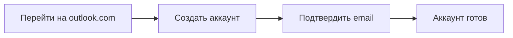

<div align="center">

:atom: 
# Регистрация разработчика Microsoft Edge Extension
### *Полное руководство с нуля до публикации*

[]()
[]()
[]()
[]()
[]()
[]()

</div>

---

## 📋 Оглавление

- [Введение](#-введение)
- [Требования](#-требования)
- [Пошаговая инструкция](#-пошаговая-инструкция)
- [Проверка статуса](#-проверка-статуса)
- [Частые проблемы](#-частые-проблемы)
- [Чек-лист](#-чек-лист)

---

## 🎯 Введение

Это руководство поможет вам **бесплатно** зарегистрироваться как разработчик расширений для Microsoft Edge и подготовиться к публикации вашего первого расширения.

### Что вы получите:
- ✅ Аккаунт разработчика Microsoft Edge
- ✅ Доступ к публикации расширений
- ✅ Возможность загружать расширения в Edge Add-ons
- ✅ Бесплатно навсегда

---

## 📝 Требования

```csv
Компонент,Требование,Проверено
Аккаунт Microsoft,Email (Outlook/Hotmail),✓
Браузер,Microsoft Edge (рекомендуется),✓
Интернет,Стабильное соединение,✓
Время,30 минут,✓
Бюджет,0 рублей,✓
```

---

## 🚀 Пошаговая инструкция

### Этап 1: Создание Microsoft аккаунта



<details>
<summary><b>📧 Подробная инструкция</b></summary>

1. Откройте [Outlook.com](https://outlook.com)
2. Нажмите **"Создать бесплатный аккаунт"**
3. Выберите имя пользователя (например: `yourname@outlook.com`)
4. Придумайте надежный пароль
5. Подтвердите номер телефона (опционально)
6. Нажмите **"Далее"**

</details>

### Этап 2: Регистрация разработчика

```ascii
╔══════════════════════════════════════════════════════════════╗
║                    ПРОЦЕСС РЕГИСТРАЦИИ                       ║
╠══════════════════════════════════════════════════════════════╣
║  ┌─────────┐    ┌─────────┐    ┌─────────┐    ┌─────────┐   ║
║  │ ШАГ 1   │ -> │ ШАГ 2   │ -> │ ШАГ 3   │ -> │ ШАГ 4   │   ║
║  │ Перейти │    │ Войти   │    │ Запол-  │    │ Подтвер-│   ║
║  │ на сайт │    │ в акк   │    │ нить    │    │ дить    │   ║
║  └─────────┘    └─────────┘    └─────────┘    └─────────┘   ║
╚══════════════════════════════════════════════════════════════╝
```

#### Шаг 1: Перейдите на страницу регистрации

```bash
# Откройте в браузере:
https://developer.microsoft.com/en-us/microsoft-edge/register/
```

#### Шаг 2: Заполните форму

```yaml
Форма регистрации:
  Account Type: Individual (Физическое лицо)
  Country/Region: Russia (или ваша страна)
  First Name: Иван
  Last Name: Иванов
  Email: yourname@outlook.com
  Phone: +7 XXX XXX-XX-XX (опционально)
```

#### Шаг 3: Примите условия

```javascript
✅ Согласен с условиями использования
✅ Согласен с политикой конфиденциальности
✅ Согласен получать уведомления
```

#### Шаг 4: Нажмите "Register"

```bash
# После нажатия вы увидите:
"Registration successful! Check your email."
```

### Этап 3: Подтверждение email

```csv
Время ожидания,Действие,Результат
0-5 минут,Проверить почту,Письмо от Microsoft
При получении,Нажать "Verify email",Аккаунт активирован
```

### Этап 4: Вход в панель разработчика

```bash
# Прямая ссылка на панель управления:
https://microsoftedge.microsoft.com/addons/
```

```ascii
┌─────────────────────────────────────────────────────┐
│  Microsoft Edge Add-ons                             │
├─────────────────────────────────────────────────────┤
│                                                     │
│  🔍 Поиск расширений                                │
│                                                     │
│  [📤 SUBMIT EXTENSION]  ← НАЖМИТЕ СЮДА              │
│                                                     │
│  Популярные расширения                              │
│  • AdBlock                                          │
│  • Grammarly                                        │
│                                                     │
└─────────────────────────────────────────────────────┘
```

---

## ✅ Проверка статуса

### Как убедиться, что регистрация прошла успешно:

```bash
# 1. Откройте панель разработчика:
https://microsoftedge.microsoft.com/addons/submit

# 2. Вы должны увидеть:
```

```json
{
  "status": "developer_registered",
  "message": "You can now submit extensions",
  "features": [
    "upload_zip",
    "manage_extensions",
    "view_statistics",
    "update_versions"
  ]
}
```

### Визуальная проверка:

```diff
+ ✅ Кнопка "Submit extension" активна
+ ✅ Нет сообщений об ошибках
+ ✅ Можно загрузить ZIP файл
- ❌ Нет предупреждения о регистрации
```

---

## 🛠 Частые проблемы и решения

### Проблема 1: Не вижу кнопку "Submit extension"

```yaml
Причина: Не завершена регистрация разработчика
Решение:
  1. Перейдите на https://developer.microsoft.com/en-us/microsoft-edge/register/
  2. Заполните форму заново
  3. Подтвердите email
  4. Подождите 10 минут
```

### Проблема 2: Ошибка "Account not verified"

```python
def fix_verification():
    """
    Решение проблемы верификации
    """
    # Шаг 1: Проверьте папку "Спам"
    check_spam_folder()
    
    # Шаг 2: Запросите письмо повторно
    resend_verification_email()
    
    # Шаг 3: Используйте другой email
    use_different_email()
    
    return "verified"
```

### Проблема 3: Пустой интерфейс Partner Center

```bash
# Решение 1: Используйте прямую ссылку
https://microsoftedge.microsoft.com/addons/submit

# Решение 2: Очистите кэш браузера
Ctrl + Shift + Del → Выбрать "Все время" → Очистить

# Решение 3: Используйте режим инкогнито
Ctrl + Shift + N
```

---

## 📊 Анимация процесса регистрации

```ascii
Время: 0:00
┌─────────────────────────────────────┐
│  🚀 Начало регистрации               │
│  █░░░░░░░░░░░░░░░░░░░░░░░░░░░░░░  0% │
└─────────────────────────────────────┘

Время: 0:05
┌─────────────────────────────────────┐
│  📝 Заполнение формы                 │
│  ███░░░░░░░░░░░░░░░░░░░░░░░░░░░░ 15% │
└─────────────────────────────────────┘

Время: 0:10
┌─────────────────────────────────────┐
│  📧 Отправка письма                  │
│  ██████░░░░░░░░░░░░░░░░░░░░░░░░░ 30% │
└─────────────────────────────────────┘

Время: 0:15
┌─────────────────────────────────────┐
│  ✅ Подтверждение email              │
│  █████████░░░░░░░░░░░░░░░░░░░░░░ 50% │
└─────────────────────────────────────┘

Время: 0:20
┌─────────────────────────────────────┐
│  🔑 Активация аккаунта               │
│  █████████████░░░░░░░░░░░░░░░░░░ 70% │
└─────────────────────────────────────┘

Время: 0:25
┌─────────────────────────────────────┐
│  🎉 Регистрация завершена!           │
│  ███████████████████████████████ 100%│
└─────────────────────────────────────┘
```

---

## ✅ Чек-лист для проверки

```markdown
### До начала:
- [ ] Есть аккаунт Microsoft
- [ ] Доступ к email
- [ ] Установлен Edge браузер

### Во время регистрации:
- [ ] Заполнена форма разработчика
- [ ] Подтвержден email
- [ ] Приняты условия использования

### После регистрации:
- [ ] Открывается https://microsoftedge.microsoft.com/addons/submit
- [ ] Видна кнопка загрузки расширения
- [ ] Нет ошибок доступа
```

---

## 📞 Полезные ссылки

| Ресурс | Ссылка | Назначение |
|--------|--------|------------|
| Регистрация | [developer.microsoft.com/register](https://developer.microsoft.com/en-us/microsoft-edge/register/) | Регистрация разработчика |
| Панель управления | [microsoftedge.microsoft.com/addons](https://microsoftedge.microsoft.com/addons/) | Управление расширениями |
| Загрузка расширения | [addons/submit](https://microsoftedge.microsoft.com/addons/submit) | Публикация |
| Документация | [docs.microsoft.com/microsoft-edge/extensions](https://docs.microsoft.com/en-us/microsoft-edge/extensions-chromium/) | Техническая документация |

---

## 🎉 Поздравляю!

```ascii
    ╔═══════════════════════════════════════╗
    ║                                       ║
    ║   🎊 ВЫ ТЕПЕРЬ РАЗРАБОТЧИК EDGE! 🎊   ║
    ║                                       ║
    ║   ✓ Аккаунт активирован               ║
    ║   ✓ Можно публиковать расширения      ║
    ║   ✓ Бесплатно                         ║
    ║                                       ║
    ║   Следующий шаг:                      ║
    ║   Загрузите ваше расширение!          ║
    ║                                       ║
    ╚═══════════════════════════════════════╝
```

---

## 📱 Поддержка

Если возникли проблемы:

1. **Официальная поддержка**: [Microsoft Edge Extensions Support](https://developer.microsoft.com/en-us/microsoft-edge/extensions/support/)
2. **Форум разработчиков**: [Stack Overflow - edge-extensions](https://stackoverflow.com/questions/tagged/microsoft-edge-extension)
3. **GitHub Issues**: [Microsoft Edge Extensions](https://github.com/MicrosoftEdge/MSEdgeExplainers)

---

<div align="center">

**[⬆ Вернуться к началу](#-регистрация-разработчика-microsoft-edge-extension)**

*Сделано с ❤️ для сообщества разработчиков*

*Версия 1.0 | Последнее обновление: Апрель 2026*

</div>
